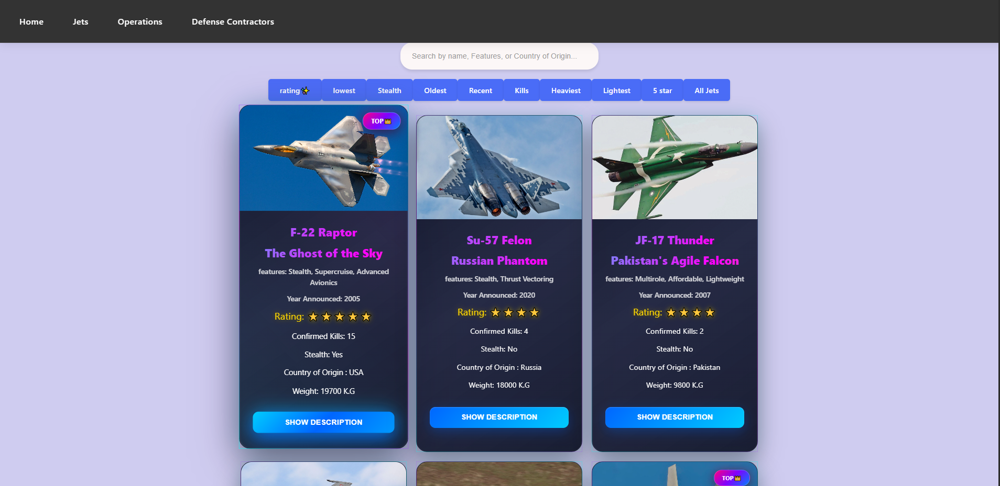

# JetWiki – MERN Stack Template

//I have to figure out hosting and more on CRUD operations

A full-stack MERN (MongoDB, Express, React, Node.js) application template showcasing historical air combat operations, jets, and defense companies. Perfect for learning full-stack development or as a starting point for your own projects.

## ✨ Features

- **Frontend**: React with Vite for fast development and hot reload
- **Backend**: Node.js with Express for RESTful API
- **Database**: MongoDB for flexible data storage
- **Clean Architecture**: Modular and well-organized codebase
- **Ready to Deploy**: Easy setup with environment configuration





## 🛠️ Quick Start

### 1. Clone & Install

```bash
# Clone the repository
git clone https://github.com/zayd100/jetwiki.git
cd jetwiki

# Install backend dependencies
cd Back-end
npm install

# Install frontend dependencies
cd ../Front-end
npm install
```

### 2. Environment Setup

Create a `.env` file in the `Back-end/` directory:

```env
MONGO_URI=mongodb://127.0.0.1:27017/jetwiki
PORT=5000
```

> **Note**: Replace with your own MongoDB URI (local or cloud-based like MongoDB Atlas)

### 3. Start Development Servers

**Backend Server** (Terminal 1):
```bash
cd Back-end
node server.js
```
Server runs on: `http://localhost:5000`

**Frontend Server** (Terminal 2):
```bash
cd Front-end
npm run dev
```
Frontend runs on: `http://localhost:5173`

### 4. Verify Setup

- **Frontend**: Open `http://localhost:5173` in your browser
- **Backend API**: Test at `http://localhost:5000/api/test`

Expected API response:
```json
{ "message": "Backend is working!" }
```

## 📊 Seed Sample Data (Optional)

Populate your database with sample jets, operations, and company data:

```bash
cd Back-end
node seed.js
```


## 🏗️ Project Structure

```
jetwiki/
├── Front-end/                 # React frontend
│   ├── src/
│   ├── package.json
│   └── vite.config.js
├── Back-end/               # Node.js backend
│   ├── models/           # MongoDB models
│   ├── routes/           # API routes
│   ├── server.js         # Main server file
│   └── seed.js           # Database seeding
└── README.md
```

## 🚀 Deployment

This template is ready for deployment on platforms like:
- **Vercel** (Frontend)
- **Heroku** (Backend)
- **MongoDB Atlas** (Database)
- **Railway** (Full-stack)

## 🤝 Contributing

This is an open template! Feel free to:
- Fork and modify for your needs
- Submit issues or improvements
- Use as a learning resource
- Build something amazing on top of it
- 

## 📝 License

This project is open source and available under the [MIT License](LICENSE).

---

 by [Zayd](https://github.com/zayd100)**

